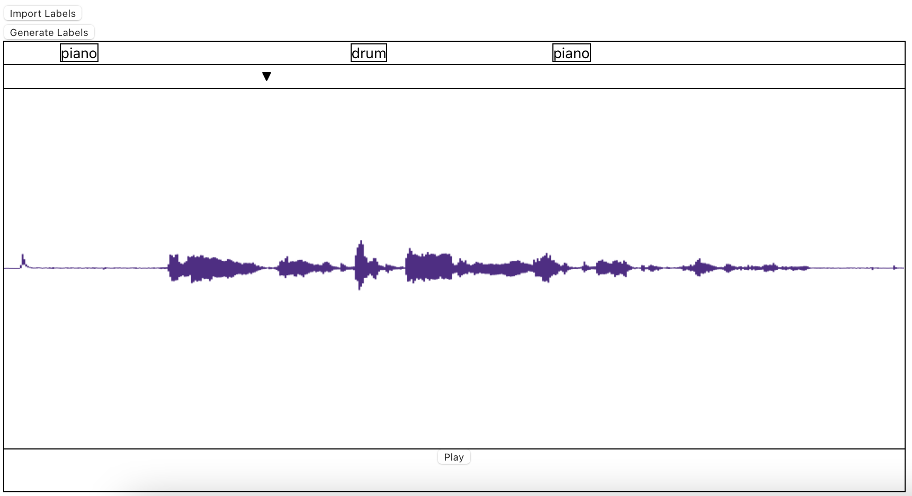
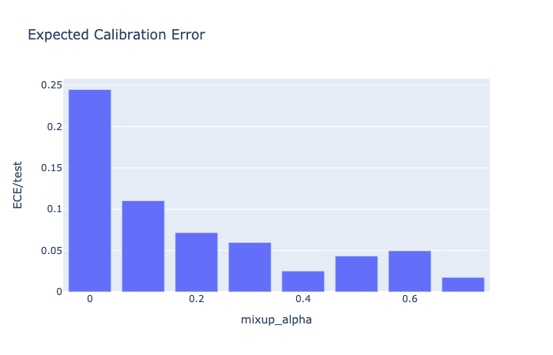
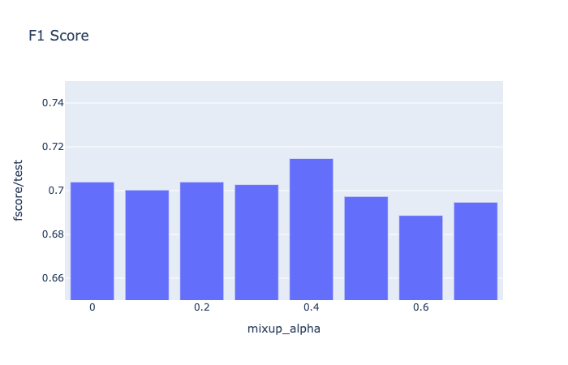
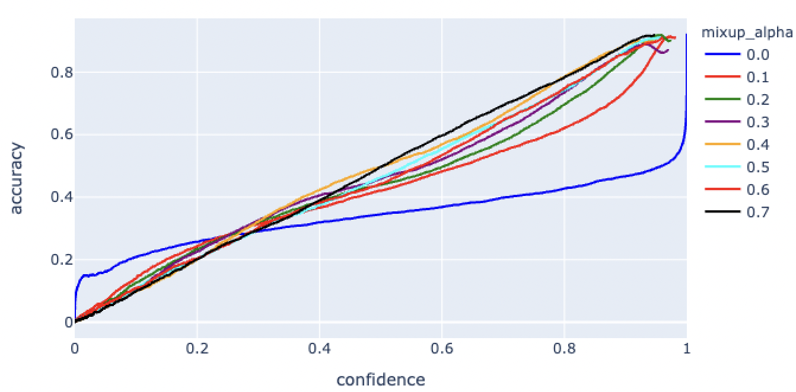
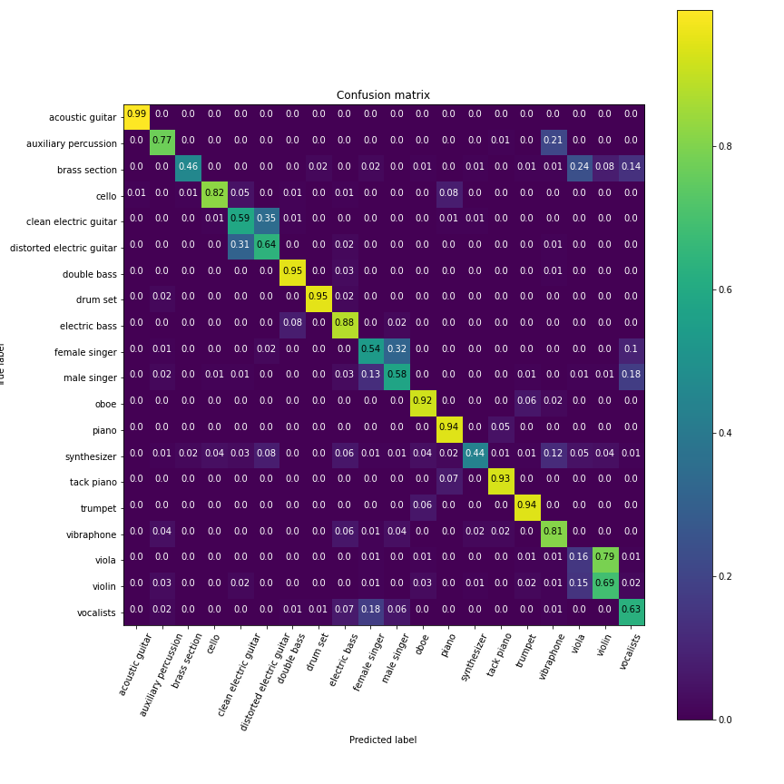

## About
The COD Instrument Labeler is a tool designed to show how digital audio workstations can be improved to help audio engineers with vision impairments navigate through their tracks more easily.

Our solution is a web interface that allows an end user to upload a track and have it automatically labeled in the graphical interface by pressing "Generate Labels". The website will label each second of audio in the track and display those to the user in the labels section.

## Motivation
A common problem that occurs in the audio engineering workflow is having to process many tracks at once. Consider a day of heavy recording at the studio: When you get back, you'll have to import the 80 or so tracks that you've recorded and manually comb through them to apply labels and figure out what's what. This process can take painstakingly long, but using the latest technology in sound event detection (SED) machine learning research makes the task fully automatable.

## Overview
We created a proof of concept design that is intended to simulate the experience we hope to bring to a digital audio workstation (DAW). Digital audio workstations are the state of the art audio editing and creation tools. Notable examples include Logic Pro, Pro Tools, Ableton, FL Studio, Reaper, etc.

Our solution provides a label for each second of audio in the track, coalesced. Not only that, we added custom navigation features that allow us to more easily move between labels with the same name, such as a "Piano" label at 5 seconds to a "Piano" label at 15 seconds. These labels are screenreader friendly and tested with NVDA on Windows and VoiceOver on macOS. We also provided manual labeling, playback, and a movable playhead to simulate the basic functionality of a DAW.

Currently, we are recognizing the following types of sounds:

- acoustic guitar
- auxiliary percussion
- brass section
- cello
- clean electric guitar
- distorted electric guitar
- double bass
- drum set
- electric bass
- female singer
- male singer
- oboe
- piano
- synthesizer
- tack piano
- trumpet
- vibraphone
- viola
- violin
- vocalists

## Interface
[Try It Out](https://cod-audio.github.io/cod/) | [View the Source](https://github.com/cod-audio/cod)

A screenshot of the interface is visible below. The demo website contains information on how to use the interface, including special navigation commands to move between the labels. It has been tested on Safari and Chrome.



The imported/generated labels are placed at their onset (start) time and the playhead (black upside down triangle) can be used to move around the track. At the bottom of the screen is a play/plause button. There are several navigation controls listed on the website that can be used to move about the labels more easily. Our current implementation also supports adding manual labels.

The goal of the interface is to emulate the track list of a DAW. Currently, there is only support for one track. To reset the interface, simply refresh the page and load a new track.

The interface was created using React.

## Backend
[View the Source](https://github.com/cod-audio/cod-api)

We're using a flask app to hand off labels and audio between the front-end interface and the machine learning model that powers the automatic labeler. Our app is hosted on [Heroku](https://www.heroku.com).

Audio is passed from the local machine to the flask app, where the model processes the audio and assigns text labels to the track. These text labels are then passed back to the front-end and displayed on the end user's web page.

## Model
[View the Source](https://github.com/hugofloresgarcia/instrument-recognition)

Big picture, our model consists of three main parts: a mel spectrogram input representation, a pre-trained, convolutional audio embedding model, and a neural network classifier.

### Input Representation

We use a 128-bin Mel Spectrogram of 1 second of audio as our input. Here are some hyperparameters:

- 48kHz audio goes through a log-mel spectrogram.
    - This means that the highest frequency we can represent is 24kHz (one half of the sample rate). This is well above the range of human hearing (around 18-20kHz)

- Mel Spectrogram hyperparameters:
    - Number of Mel frequency bins: 128
    - Magnitude representation (not power)
    - FFT window size: 2048 samples (42.67ms)
    - FFT hop size: 242 samples (5ms)


### Embedding
We use the audio subnetwork of the [L3-net](https://github.com/marl/openl3) architecture for our embedding model. The weights are initialied to the mel128, music model variant.

*Note*: depending on the kernel size of the last maxpool layer, you have two different embedding sizes to choose from:

- With a maxpool kernel of (16, 24), your output embedding is size 512
- With a maxpool kernel of (4, 8), your output embedding is size 6144

We found during preliminary testing that using an embedding size of 6144 worked best in our case.

### Classifier
We use fully connected layers with ReLU activations for our classifier. Because PyTorch code is super readable, here's a code snippet with out model architecture.

```python
class MLP6144(pl.LightningModule):

    def __init__(self, dropout, num_output_units):
        super().__init__()

        self.fc = nn.Sequential(
            nn.BatchNorm1d(6144),
            nn.Linear(6144, 512),
            nn.ReLU(),
            nn.Dropout(dropout),

            nn.BatchNorm1d(512),
            nn.Linear(512, 128),
            nn.ReLU(),
            nn.Dropout(dropout),

            nn.BatchNorm1d(128),
            nn.Linear(128, num_output_units))

    def forward(self, x):
        return self.fc(x)
```

where `num_output_units` refers to the number of classes in out dataset.

We use batch normalization, dropout, and ReLU activations, as well as a Softmax in the output (not pictured above because it's included in our loss function).

### Training

#### Dataset
We used the [MedleyDB](https://https://github.com/marl/medleydb) dataset for our experiments. The MedleyDB dataset is a multitrack dataset with 122 mixtures of real-life audio recodings of musical instruments and vocals, each with their corresponding stems. We use the [MedleyDB](https://https://github.com/marl/medleydb) artist conditional split function, and split our dataset into 85% train, 15% validation. We remove all classes not present in the validation set, and end up with a 20 instrument dataset. 

The 20 instruments we consider are: `acoustic guitar`,`auxiliary percussion`,`brass section`,`cello`,`clean electric guitar`,`distorted electric guitar`,`double bass`,`drum set`,`electric bass`,`female singer`,`male singer`,`oboe`,`piano`,`synthesizer`,`tack piano`,`trumpet`,`vibraphone`,`viola`,`violin`,`vocalists`. 

#### Data Augmentation
Before adding effects to each separate audio clip, we remove all silent regions from each audio stem and split the stems into 1 second segments, with a hop size of 250ms. After chunking our data into 1 second segments, we end up with 288k training samples and 56k validation samples.

We preprocess our chunks with random amounts of the following effects (using [pysox](https://github.com/rabitt/pysox)): EQ (up to 5 bandpass filters, low pass and high pass filtering), pitch shifting, time stretching, overdrive, flanger and compression.


#### Hyperparameters
Here's our set of training hyperparameters:

- number of epochs: 100
- batch size: 512
- learning rate: 0.0003, then 0.00003 (after 50 epochs), then 0.000003 (after 75 epochs)
- loss: weighted cross entropy.
- optimizer: Adam


### Mixup experiment
Since our dataset does not cover every musical instrument that may appear in an audio production scenario, we must deal with out-of-distribution data without making overconfident predictions and potentially worsening the user experience for visually-impaired users by introducing erroneous information that they may have to manually correct.

Deep learning models trained with only one-hot encoded labels are likely to make low-entropy predictions regardless of the classifier’s true uncertainty, or whether the provided input lied within the training distribution or not. [Thulasidasan et. al](https://arxiv.org/pdf/1905.11001.pdf) find that models trained using mixup exhibit significantly better calibration properties for both in and out of distribution data when compared to models trained using regular cross entropy, under the argument that mixup provides a form of entropic regularization on the training signals.

To improve the predictive uncertainty of our model, we conduct an experiment using varying degrees of mixup, and observe its effect on the model's calibration, as well as classification performance.

#### An overview on mixup
Mixup training is a recently proposed method for training neural networks on classification tasks that consists of convexly combining inputs and targets in the network. That is, for randomly sampled training examples `(x1, y1)` and `(x2, y2)` we generate new training examples through linear interpolation:

```python
def mixup(x1, y1, x2, y2, alpha):
    # sample lambda from a beta distribution
    lambda_ = beta(alpha, alpha)

    mixed_x = lambda_ * x1 + (1 - lambda_) * x2
    mixed_y = lambda_ * y1 + (1 - lambda_) * y2
    return mixed_x, mixed_y
```

Where `lambda_` is a linear interpolator drawn from a symmetric Beta distribution, and `alpha` is a hyperparameter controlling the strength of the convex combination. That is, smaller values of `alpha` approach the base case, where only one of the training examples is considered, while larger values of `alpha` result in more even combinations of the training examples.

#### Experiment setup

We evaluate the effect of mixup training on the predictive uncertainty and classification performance of our models. We train model variants with varying degrees of alpha ∈ {0, 0.1, 0.2, 0.3, 0.4, 0.5, 0.6, 0.7}, where alpha = 0 is the baseline case, with no degree of interpolation between training samples. We do mixup at the embedding level.

#### Metrics

We evaluate our models with two metrics: **micro-averaged F1 score** and **expected calibration error (ECE)**.

**F1 Score**: The F1 score is a more preferable classification metric than accuracy because it takes dataset imbalance into account. We assume the reader is familiar with the definition of F1 score. 

**Expected Calibration Error (ECE)**

We use ECE as a scalar metric indicative of our model's predictive uncertainty. 

The ECE of a classifier is defined as the expected difference between classifier's confidence and prediction accuracy. That is, for a given set of predictions, a perfectly calibrated model with an accuracy of 70% will have an average confidence of 70%. This is much more preferable than an overconfident model that is only 70% accurate but has an average confidence of 90%. 

To calculate the ECE of a set of predictions, we bin the set of predictions into `M` bins and calculate the weighted average of the difference between accuracy and confidence: 


where 
- conf(Bₘ) if the average confidence of prediction in bin Bₘ 
- acc(Bₘ) is the accuracy for the predictions in bin Bₘ
- n is the total number of samples in all bins

### Results

**Effect of Mixup on the Expected Calibration Error** *(lower is better)*


**Effect of Mixup on F1 score** *(higher is better*)


The model with `alpha = 0.4` achieves both the highest F1 score and lowest ECE. We choose this model for our labeler. Additionaly, notice that F1 score drops with high `alpha`. We believe this is due to underfitting. 

**Reliability Diagram**


The reliability diagram plots accuracy vs confidence for test set predictions. To create a reliability diagram, we split our test set predictions into M bins and calculate the **accuracy** and **average confidence** for each bin. Then, we sort the bins by confidence (X axis) and plot the accuracy with respect to confidence for each bin. 

A model with perfect calibration will be as confident as it is accurate, and would be visualized as the `y=x` line in our reliability plot.

**Normalized Confusion Matrix**

Here is the normlized confusion matrix for our best model (`alpha` = 0.4):

*x axis represents predicted labels, while y axis represents true labels.*
